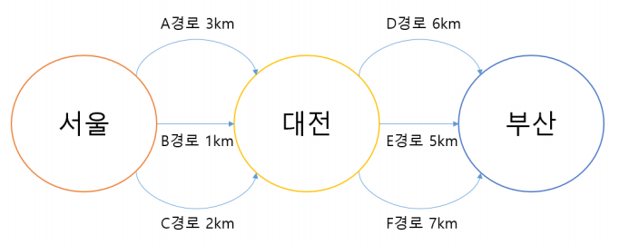

## 동적 계획법 (Dynamic Programming) 알고리즘

> 큰 문제를 작은 문제로 나누어 푸는 알고리즘

<br>

- 내가 느낀 `DP`는 재귀로 푸는 과정에서 따로 중복되는 값을 처리하지 않고,  
  재귀랑 비슷하게 풀이하는 방법이었다.

- 또한 `DP`는 계산결과를 저장하는 메모리 기법인 `메모제이션(Memozation)`을 사용한다.  
  불필요한 중복 계산을 피할 수 있게 해준다.

- `DP`는 주로 최적 부분 구조(optimal-substructure) 문제에 자주 사용된다.  
  부분문제에서 최적의 값을 구하면서 최적의 전체값을 구하는 방식

  

  **서울에서 부산까지의 최적 경로를 찾기 위해서는 (서울 - 대전), (대전 - 부산) 각각의 최적 경로를 찾으면 된다.**

<br>

### 대표적인 DP 알고리즘 사용 예시

- top-down 방식

  - `피보나치 수열`

  ```js
  function 피보나치(n) {
    const dp = new Array(n + 1); // 사용한 값들 (더했었던 값들)을 저장할 배열

    // 초기 세팅
    dp[0] = 0;
    dp[1] = 1;

    for (let i = 2; i <= n; i++) {
      dp[i] = dp[i - 1] + dp[i - 2];
    }

    return dp[n];
  }
  ```

  <br>

- bottom-up 방식

  - `배낭문제` (<a href="https://github.com/jiyun1006/TIL/blob/main/algorithm-test/baek/baek-1535.md">비슷한 백준 문제</a>)  
    `DP`를 이용한 가장 기본적인 문제.  
    (정해진 가방의 용량에 최대 가치의 물건을 넣는 문제.)  
    **정해진 무게까지 최적의 물건을 구하면서 진행해나간다.**

  ```js
  function 배낭문제(무게, 값, 용량) {
    const n = 무게배열의 길이;

    const dp = Array.from({length : n + 1}, () => Array(용량 + 1).fill(0))

    for (let i = 1; i <= n; i++) {
      for (let j = 1; j <= 용량; j++) {
        // j를 1부터 가방의 용량까지 반복하면서 배낭에 넣을 수 있는 경우 없는 경우를 구분한다.
        // 배낭에 넣을 수 없는 경우
        if (무게[i - 1] > j) {
          dp[i][j] = dp[i - 1][j];
        // 배낭에 넣을 수 있는 경우
        } else {
          dp[i][j] = Math.max(
            // 제일 처음이라면, 초기값과 지금 들어오는 값을 비교한다.
            // 이후부터는, 들어온 값과 들어올 값들을 비교하면서 최적의 무게를 찾아나간다.
            dp[i - 1][j],
            dp[i - 1][j - 무게[i - 1]] + 값[i - 1],
          );
        }
      }
    }

    return dp[n][용량];
  }
  ```

  <br>

  - `최장 증가 수열(Longest Increasing Subsequence)`  
     `DP`를 이용해서 각 원소의 마지막으로 하는 부분수열의 값을 저장한다.

    ```js
    function longestIncreasingSubsequence(nums) {
      const n = nums.length;

      // 처음의 길이는 원소하나이므로 1로 채운다.
      const dp = Array.from({ length: n }).fill(1);

      for (let i = 1; i < n; i++) {
        for (let j = 0; j < i; j++) {
          // 증가 수열이므로 더 큰수를 발견했을 때,
          if (nums[i] > nums[j]) {
            // 이전 원소의 길이값에서 1을 더한값과 현재의 길이값을 비교한다.
            dp[i] = Math.max(dp[i], dp[j] + 1);
          }
        }
      }

      // 결과 중 최대값 반환
      return Math.max(...dp);
    }
    ```

<br><br>

> **아직 DP를 생각하는 것과 DP로 문제를 푸는 것이 익숙치 않다.**  
> **DP보다 재귀가 먼저 떠올랐고, 재귀를 하는 도중 저장값을 만드는 과정에서 DP가 생각이 났다.**  
> **문제를 계속 풀어보며 다양한 유형에 적용해봐야 겠다.**

<br>

<a href="https://velog.io/@boyeon_jeong/동적계획법Dynamic-Programming">참고 문서</a>
