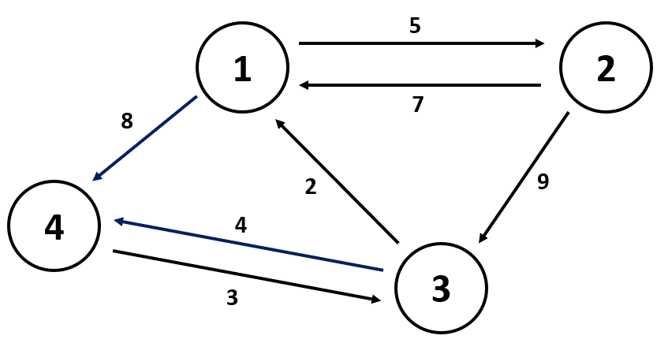

## 플루이드 와샬(Floyd-Warshall) 알고리즘

> 모든 최단 경로를 구하는 알고리즘 (하나의 경유지를 거쳐)

<br>

- 플로이드 와샬 알고리즘은 2차원 테이블에 최단 거리 정보를 저장한다.

- 모든 노드에서 다른 모든 노드로의 최단 경로를 구하는 알고리즘이다.

- 하지만, `O(n^3)` 이기 때문에, 함부로 사용하면 안될 듯 하다.

- 다른 노드로의 경로를 계산해서(하나의 경유지를 거쳐), 작은 수를 업데이트해준다.

  

- 위 사진의 그래프를 이용해 알고리즘을 구현해보자.

<br>

- 간선의 가중치를 이용해서 2차원 배열을 만든다.

|     |     |     |     |
| --- | --- | --- | --- |
| 0   | 5   | Inf | 8   |
| 7   | 0   | 9   | Inf |
| 2   | Inf | 0   | 4   |
| Inf | Inf | 3   | 0   |

- 이후에, 차례대로 1번부터 경유지로 설정하여, 각각의 노드들의 최단 거리를 갱신한다.

```js
const floydWarshall = (dist) => {
  const len = dist.length;
  for(let i = 0; i < len; i+=1){ // 경유지를 위한 반복문
    for(let j = 0; j < len j+=1){ // 출발지를 위한 반복문
      for(let k = 0; j< len k+=1){ // 도착지를 위한 반복문
      // 출발지에서 도착지의 경로와 (출발지에서 경유지 + 경유지에서 도착지)의 경로를 비교해서 더 짧은 경로로 업데이트한다.
        if(j !== k && dist[j][i] !== Inf && dist[i][k] !== Inf)
          dist[j][k] = Math.min(dist[j][k], dist[j][i] + dist[i][k]);
      }
    }
  }
}
```
